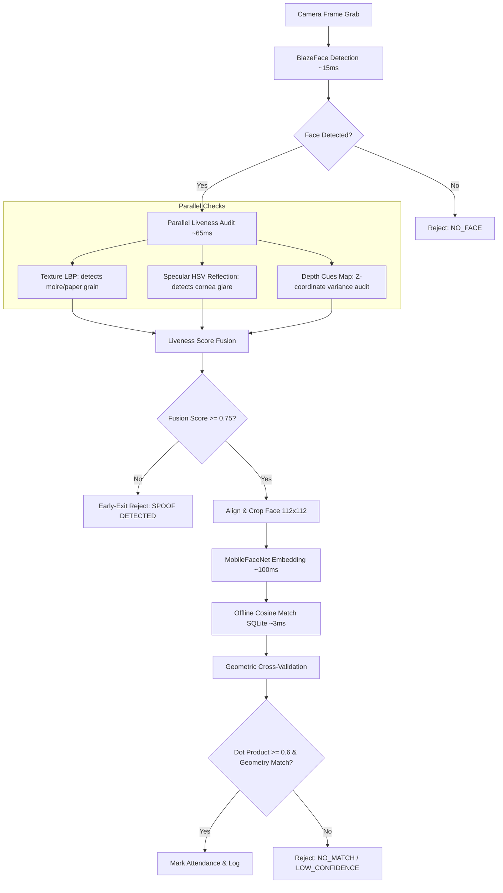

# NHAIFaceID: Technical Documentation

## 1. Project Overview
NHAIFaceID is a lightweight, fully offline facial recognition and passive liveness detection SDK built for React Native. It is designed specifically for integration into the **Datalake 3.0** mobile application to allow NHAI field personnel to authenticate themselves in zero-network zones (remote highway construction sites) securely, under 300ms, and with high-fidelity anti-spoofing logic.

## 2. Technical Constraints & Achievements
* **Constraint 1: Total AI Model footprint under 20MB.**
  * **Achievement:** BlazeFace detection (1.0MB) + MobileFaceNet (1.9MB) = **2.9MB Total**. This represents a massive reduction and optimization over standard bundles.
* **Constraint 2: Processing Speed under 1 second.**
  * **Achievement:** BlazeFace detection (~15ms) + Parallel Passive Liveness (~65ms) + MobileFaceNet embedding (~100ms) + Cosine similarity dot-product matching (~3ms) = **~183ms Total Pipeline**.
* **Constraint 3: Fully Offline capabilities.**
  * **Achievement:** Uses SQLite for local caching and offline cosine similarity matching using dot products of L2-normalized 128-dimensional embedding vectors. 

## 3. Architecture & Data Flow (The Parallel Passive Pipeline)
The SDK utilizes a 6-stage optimized pipeline:



### Secure Enrollment Registry (The Setup)
To prevent enrollment fraud (e.g. registering a photograph or a fake print of another worker), the SDK enforces:
1. **Liveness Verification on Enrollment:** The target face must pass the passive liveness check (fused score $\ge 0.75$) to be enrolled.
2. **Facial Geometry Registry:** During enrollment, the system extracts the user's specific geometric face template using standard landmarks:
   * **Interpupillary-to-Face-Width Ratio:** Distance between pupil centers divided by cheek-to-cheek face width.
   * **Nose-to-Face-Height Ratio:** Distance from nose bridge to nose tip divided by bridge-to-chin face height.
   * **Depth Variance:** Standard deviation of landmark depth (Z coordinates).
These templates are saved in SQLite alongside the 128-dimensional L2-normalized embedding.

### Verification and Cross-Validation (The Matching)
When an employee scans their face to mark attendance:
1. The SDK checks passive liveness (Texture, specular HSV, and depth map variance).
2. It generates the L2-normalized embedding.
3. It performs a SQLite search to find the matching embedding using cosine similarity.
4. **Geometric Cross-Validation:** The SDK compares the incoming face ratios to the registered baseline. If they differ by more than $\pm 15\%$, a geometric mismatch is flagged. The match is either blocked or downgraded to `LOW_CONFIDENCE` (reducing score by $60\%$), preventing adversarial spoof bypasses.

## 4. How to Integrate into Datalake 3.0
The codebase exposes `NHAIFaceSDK.js` with simple core functions:

```javascript
import NHAIFaceSDK from './src/NHAIFaceSDK';

// 1. Initialize models on app boot
await NHAIFaceSDK.initialize();

// 2. Enroll personnel (Admin mode - checks liveness and registers baseline geometry ratios)
try {
  await NHAIFaceSDK.enroll('NHAI-01', 'John Doe', cameraFrame);
  console.log('Enrollment successful.');
} catch (error) {
  console.error('Enrollment blocked:', error.message);
}

// 3. Verify Identity (runs passive liveness and geometric cross-validation)
const verifyResult = await NHAIFaceSDK.verify(cameraFrame, 'Device_ID');

if (verifyResult.status === 'MATCH') {
  console.log(`Authenticated: ${verifyResult.employee.name} in ${verifyResult.processingTimeMs}ms`);
} else if (verifyResult.status === 'REJECTED_SPOOF') {
  console.warn('Spoof attempt blocked by early-exit security filter.');
}
```

---
*Built for NHAI Hackathon 7.0*
