# NHAIFaceID — Complete Deep Analysis

> **Purpose:** Offline face recognition SDK for NHAI Datalake 3.0 — allows field personnel at remote highway sites (zero internet) to enroll and verify identity using face biometrics on Android devices.

---

## 🏗️ True Architecture — What Actually Happens

```mermaid
graph TD
    A["📱 App.js Boot"] --> B["NHAIFaceSDK.initialize()"]
    B --> B1["initDB() — SQLite tables"]
    B --> B2["initFaceDetector() — TFJS MediaPipe ⚠️ usually fails on device"]
    B --> B3["initFaceRecognition() — Native Kotlin TFLite ✅ REAL"]
    B --> B4["loadAntiSpoofModel() — ONNX MiniFASNet"]
    B --> B5["awsSyncManager.startListener() — NetInfo"]

    subgraph "ENROLLMENT FLOW (EnrollScreen.js)"
        E1["Camera opens via CameraView"] --> E2["MLKit Frame Processor detects face"]
        E2 --> E3["Bounding box + contours normalized"]
        E3 --> E4["getFaceMesh468() generates 468-pt mesh from contours"]
        E4 --> E5["Quality checks: motion, pose, spoof variance"]
        E5 --> E6["5-pose guided capture: CENTER → LEFT → RIGHT → UP → DOWN"]
        E6 --> E7["Each pose: capturePhoto() → native Kotlin TFLite → 192-D embedding"]
        E7 --> E8["5 embeddings averaged → L2-normalized → single 192-D vector"]
        E8 --> E9["NHAIFaceSDK.enrollEmbedding() runs liveness + duplicate check"]
        E9 --> E10["Saved to SQLite: embedding + face_ratios + depth_variance + photo"]
    end

    subgraph "VERIFICATION FLOW (VerifyScreen.js)"
        V1["Camera opens via CameraView"] --> V2["MLKit detects face, quality gate"]
        V2 --> V3["Progress bar fills in ~400ms"]
        V3 --> V4["capturePhoto() → native Kotlin TFLite → 192-D embedding"]
        V4 --> V5["NHAIFaceSDK.verifyEmbedding()"]
        V5 --> V6["1. Passive Liveness fusion check"]
        V5 --> V7["2. SQLite loop: cosine similarity vs all enrolled"]
        V5 --> V8["3. Geometric ratio cross-validation penalty"]
        V7 --> V9{"Best score > 0.68?"}
        V9 -- "Yes" --> V10["✅ MATCH — Log attendance"]
        V9 -- "0.52-0.68" --> V11["⚠️ LOW_CONFIDENCE"]
        V9 -- "<0.52" --> V12["❌ NO_MATCH"]
    end
```



---

## 📁 File-by-File Breakdown

### Native Android (Kotlin) — THE REAL ENGINE ✅

| File | Role | Status |
|------|------|--------|
| [FaceRecognitionModule.kt](file:///c:/Users/piyus/Downloads/NHAI/NHAIFaceID/android/app/src/main/java/com/nhaifaceid/FaceRecognitionModule.kt) | **Core AI engine.** Loads `MobileFaceNet.tflite` via TF Lite Android SDK, crops face from bbox, resizes to 112×112, normalizes to [-1,1], runs inference → outputs **192-D L2-normalized embedding**. Has two input methods: `generateEmbedding(base64)` and `generateEmbeddingFromFile(path)`. Also has native `cosineSimilarity()`. | **✅ REAL & WORKING** |
| [FaceRecognitionPackage.kt](file:///c:/Users/piyus/Downloads/NHAI/NHAIFaceID/android/app/src/main/java/com/nhaifaceid/FaceRecognitionPackage.kt) | Registers `FaceRecognitionModule` as a React Native native module | ✅ Working |
| [MainApplication.kt](file:///c:/Users/piyus/Downloads/NHAI/NHAIFaceID/android/app/src/main/java/com/nhaifaceid/MainApplication.kt) | Registers `FaceRecognitionPackage` in the package list | ✅ Working |

### SDK Core

| File | Role | Status |
|------|------|--------|
| [NHAIFaceSDK.js](file:///c:/Users/piyus/Downloads/NHAI/NHAIFaceID/src/NHAIFaceSDK.js) | **Central orchestrator.** `initialize()` boots everything. `enrollEmbedding()` validates liveness, deduplicates, averages multi-pose ensemble, saves to SQLite. `verifyEmbedding()` runs liveness → SQLite cosine match → geometric cross-validation. Also has `hasEnrolledPersonnel()`, `syncToAWS()`. | ✅ Working |

### Services

| File | Role | Status |
|------|------|--------|
| [faceDetection.js](file:///c:/Users/piyus/Downloads/NHAI/NHAIFaceID/src/services/faceDetection.js) | Wraps TFJS MediaPipe face detection. Checks for covered lens (mean brightness < 15). **Falls back to mock 6-point landmarks if TFJS detector fails to init** (which it usually does on device — see Issues). | ⚠️ **TFJS detector usually fails**, mock fallback is used. But on-device, CameraView's MLKit frame processor does the actual detection instead. |
| [faceRecognition.js](file:///c:/Users/piyus/Downloads/NHAI/NHAIFaceID/src/services/faceRecognition.js) | JS bridge to the native Kotlin module. `initFaceRecognition()` calls `FaceRecognitionModule.initialize()`. `generateEmbedding()` calls `FaceRecognitionModule.generateEmbeddingFromFile()`. Also has pure-JS `computeCosineSimilarity()` and `l2Normalize()`. | ✅ Working — delegates to native |
| [livenessDetection.js](file:///c:/Users/piyus/Downloads/NHAI/NHAIFaceID/src/services/livenessDetection.js) | Contains: `calculateFacialRatios()` (468/68/6-pt), `calculateDepthVariance()` (Z-coord std-dev), `calculateLandmarksVariance()` (cross-frame variance for spoof detection), `analyzeTextureLBP()`, `analyzeCornealReflection()`, `analyzeDepthCues()`, `fuseLiveness()`, `runPassiveLiveness()`, `checkPoseAngle()`, `estimatePoseAngle()`. | ⚠️ **MIXED:** `calculateFacialRatios`, `calculateLandmarksVariance`, `checkPoseAngle`, `estimatePoseAngle` are **REAL math**. But `analyzeTextureLBP()` and `analyzeCornealReflection()` return **hardcoded mock scores** (0.95 live / 0.48 spoof). |
| [antiSpoofCheck.js](file:///c:/Users/piyus/Downloads/NHAI/NHAIFaceID/src/services/antiSpoofCheck.js) | Loads `MiniFASNetV2.onnx` via ONNX Runtime RN. Crops face, resizes to 80×80, normalizes, transposes HWC→CHW, runs ONNX inference → softmax → real vs spoof score. | ⚠️ **Partially real:** Model loading + inference code is correct, but it requires a valid `tf.Tensor` as input. In the current flow, `null` is passed as the frame (since screens skip taking a tf tensor), so it returns the fallback 0.95. |
| [localStorage.js](file:///c:/Users/piyus/Downloads/NHAI/NHAIFaceID/src/services/localStorage.js) | SQLite CRUD: 3 tables (`enrolled_faces`, `verification_log`, `sync_queue`). Has migrations for `depth_variance` and `face_ratios` columns. CRUD for enrollment, verification logs, sync marking, purging. | ✅ Working |
| [awsSync.js](file:///c:/Users/piyus/Downloads/NHAI/NHAIFaceID/src/services/awsSync.js) | Listens for network reconnection via NetInfo, reads unsynced logs from SQLite, POSTs to `https://api.datalake.nhai.gov.in/v3/attendance/sync`. Uses exponential backoff (5 retries). | ⚠️ **Mock endpoint.** The fetch `.catch()` returns `{ ok: true }` so it always "succeeds". The endpoint URL is a placeholder. |
| [tfjsPlatform.js](file:///c:/Users/piyus/Downloads/NHAI/NHAIFaceID/src/services/tfjsPlatform.js) | Custom TFJS platform registration for React Native/Hermes. Implements `fetch`, `encode`, `decode`, `now` using XHR + Buffer. Registered before anything else in App.js. | ✅ Working — needed for TFJS to function in Hermes |

### Components

| File | Role | Status |
|------|------|--------|
| [CameraView.js](file:///c:/Users/piyus/Downloads/NHAI/NHAIFaceID/src/components/CameraView.js) | **Critical component.** Uses `react-native-vision-camera` with a frame processor running `detectFaces()` from `react-native-vision-camera-face-detector` (which uses **MLKit** under the hood). Extracts bounding box, contours (FACE, LEFT_EYE, RIGHT_EYE, NOSE_BRIDGE, etc.), and Euler angles (yaw/pitch/roll). Feeds these to `getFaceMesh468()` which generates a 468-point mesh from real MLKit contours (or mathematical fallback). Also provides `capturePhoto()` via `useImperativeHandle`. | ✅ **THE REAL FACE DETECTION ENGINE** — MLKit via frame processor |
| [Icons.js](file:///c:/Users/piyus/Downloads/NHAI/NHAIFaceID/src/components/Icons.js) | SVG icons for Enroll, Liveness, Verify, Benchmark | ✅ UI only |
| [SyncBanner.js](file:///c:/Users/piyus/Downloads/NHAI/NHAIFaceID/src/components/SyncBanner.js) | Animated offline/syncing status banner | ✅ UI only |

### Screens

| File | Role | Status |
|------|------|--------|
| [HomeScreen.js](file:///c:/Users/piyus/Downloads/NHAI/NHAIFaceID/src/screens/HomeScreen.js) | Dashboard: shows enrolled count, verifications today, pending sync (from SQLite). Navigation cards to Enroll, Verify, UserList, Benchmark. Animated progress bar + HUD status badges. | ✅ Working |
| [EnrollScreen.js](file:///c:/Users/piyus/Downloads/NHAI/NHAIFaceID/src/screens/EnrollScreen.js) | **5-pose guided enrollment.** Form for Employee ID + Name. Opens camera, guides user through CENTER→LEFT→RIGHT→UP→DOWN. Each pose: checks quality (motion/spoof/angle), captures photo, generates 192-D embedding via native Kotlin. Averages ensemble. Has "Bypass Pose" toggle and "Force Capture" for dev. | ✅ Working |
| [VerifyScreen.js](file:///c:/Users/piyus/Downloads/NHAI/NHAIFaceID/src/screens/VerifyScreen.js) | Fast verification scan (~400ms). Captures photo, generates embedding, calls `verifyEmbedding()`. Shows MATCH/LOW_CONFIDENCE/NO_MATCH/SPOOF_REJECTED with confidence bar, timing breakdown, and "Log Attendance" button. Has "Simulate Spoof" toggle. | ✅ Working |
| [LivenessScreen.js](file:///c:/Users/piyus/Downloads/NHAI/NHAIFaceID/src/screens/LivenessScreen.js) | Standalone liveness challenge screen | ✅ Working |
| [BenchmarkScreen.js](file:///c:/Users/piyus/Downloads/NHAI/NHAIFaceID/src/screens/BenchmarkScreen.js) | Runs and displays timing + accuracy benchmarks | ✅ Working |
| [UserListScreen.js](file:///c:/Users/piyus/Downloads/NHAI/NHAIFaceID/src/screens/UserListScreen.js) | Shows all enrolled faces from SQLite, verification logs, pending syncs | ✅ Working |

### Utils

| File | Role | Status |
|------|------|--------|
| [vectorMath.js](file:///c:/Users/piyus/Downloads/NHAI/NHAIFaceID/src/utils/vectorMath.js) | `dotProduct()`, `magnitude()`, `cosineSimilarity()` — pure JS vector math | ✅ Working |
| [metrics.js](file:///c:/Users/piyus/Downloads/NHAI/NHAIFaceID/src/utils/metrics.js) | Simple `MetricsLogger` with `startTimer/endTimer/logFPS/logConfidence` | ✅ Working |
| [deviceInfo.js](file:///c:/Users/piyus/Downloads/NHAI/NHAIFaceID/src/utils/deviceInfo.js) | `getDeviceInfo()` and `generateDeviceId()` | ✅ Working |

### AI Models (in `src/models/`)

| File | Size | Role |
|------|------|------|
| `MobileFaceNet.tflite` | 5.2 MB | **Primary model.** Face embedding generation (192-D). Loaded by native Kotlin. |
| `MiniFASNetV2.onnx` | 1.7 MB | Anti-spoof model (Minivision Silent-Face). Loaded via ONNX Runtime. |
| `face_detection_short_range.tflite` | 229 KB | MediaPipe face detector. Used by TFJS (usually fails). |
| `face_landmark_68.tflite` | 1.2 MB | 68-point landmark model. **Not actually loaded/used** in any current code path. |
| `mobilefacenet_recognition.onnx` | 14 bytes | **PLACEHOLDER FILE** — only 14 bytes. Not a real model. |

---

## ⚡ The ACTUAL Pipeline (Corrected — No Geometry-First)

### Enrollment (Real Flow)
```
1. User enters Employee ID + Name
2. CameraView opens → MLKit frame processor detects face at 30fps
3. Bounding box + contours + Euler angles sent to JS thread
4. getFaceMesh468() builds 468-point mesh from real MLKit contour data
5. Quality gates run every frame:
   - Motion stability (bbox center delta < 0.035)
   - Spoof detection via cross-frame landmark variance (< 0.00012 = spoof)
   - Pose angle matching (yaw/pitch thresholds per stage)
6. For each of 5 poses (CENTER/LEFT/RIGHT/UP/DOWN):
   a. Progress bar fills over ~1 second
   b. capturePhoto() → saves JPEG to disk
   c. alignAndCropFace() → packages photo path + bbox
   d. generateEmbedding() → calls native Kotlin FaceRecognitionModule:
      - Decodes JPEG file → crops by bbox → resizes to 112×112
      - Normalizes pixels to [-1, 1]
      - Runs MobileFaceNet TFLite inference → 192-D float array
      - L2-normalizes → returns to JS
7. After all 5 poses captured:
   - 5 × 192-D embeddings averaged → single 192-D L2-normalized vector
   - Passive liveness fusion check (LBP mock + reflection mock + AI score)
   - Duplicate check: cosine similarity against all existing enrolled faces (> 0.55 = duplicate)
   - Save to SQLite: embedding JSON, face_ratios, depth_variance, thumbnail path
```

### Verification (Real Flow)
```
1. CameraView opens → MLKit detects face
2. Quality gates: pose angle + motion stability (400ms scan time)
3. capturePhoto() → native Kotlin TFLite → 192-D embedding
4. NHAIFaceSDK.verifyEmbedding():
   a. Passive liveness check (mostly mock scores + ONNX skipped if no tensor)
   b. SQLite SELECT all enrolled_faces
   c. For each: cosine similarity (JS vectorMath)
   d. Geometric ratio penalty (±25% deviation → 0.75 multiplier)
   e. Best score: >0.68 = MATCH, 0.52–0.68 = LOW_CONFIDENCE, <0.52 = NO_MATCH
5. Log result to verification_log table (for AWS sync later)
```

---

## 🚨 Issues & Gaps Found

### Critical Issues

| # | Issue | Where | Impact |
|---|-------|-------|--------|
| 1 | **TFJS Face Detector always fails on device** — `initFaceDetector()` loads MediaPipe via TFJS which crashes on most Android devices. It's suppressed via `LogBox.ignoreLogs`. The actual detection is done by MLKit in the CameraView frame processor, making `faceDetection.js` mostly dead code. | [faceDetection.js](file:///c:/Users/piyus/Downloads/NHAI/NHAIFaceID/src/services/faceDetection.js) | Low — MLKit works fine as the real engine |
| 2 | **LBP Texture & Corneal Reflection are mock** — `analyzeTextureLBP()` returns hardcoded 0.95 (live) or 0.48 (spoof). `analyzeCornealReflection()` returns hardcoded 0.92 or 0.38. No real image analysis is performed. | [livenessDetection.js L183-L211](file:///c:/Users/piyus/Downloads/NHAI/NHAIFaceID/src/services/livenessDetection.js#L183-L211) | **Medium** — Liveness fusion score is fake for 30% of the weight (AI model gets 70%) |
| 3 | **ONNX Anti-Spoof never actually runs** — `runAntiSpoofInference()` requires a `tf.Tensor3D` as input, but both EnrollScreen and VerifyScreen pass `null` as the frame to `runPassiveLiveness()`. So it always returns fallback 0.95. | [antiSpoofCheck.js L142-L144](file:///c:/Users/piyus/Downloads/NHAI/NHAIFaceID/src/services/antiSpoofCheck.js#L142-L144), [NHAIFaceSDK.js L55](file:///c:/Users/piyus/Downloads/NHAI/NHAIFaceID/src/NHAIFaceSDK.js#L55), [NHAIFaceSDK.js L161](file:///c:/Users/piyus/Downloads/NHAI/NHAIFaceID/src/NHAIFaceSDK.js#L161) | **High** — Anti-spoofing ONNX model exists but is never invoked. Liveness is effectively always-pass. |
| 4 | **Dimension mismatch: comments say 128-D but code uses 192-D** — The model actually outputs 192-D (checked in Kotlin: `EMBEDDING_DIM = 192`). But `vectorMath.js` comments say "128-d", `faceRecognition.js` comments say "128-D" in several places. The actual code handles both correctly since it just iterates array length, but documentation is misleading. | Multiple files | Low — functional but confusing |
| 5 | **`mobilefacenet_recognition.onnx` is a placeholder (14 bytes)** — This file is not a real ONNX model and is never loaded anywhere in the code. | [src/models/](file:///c:/Users/piyus/Downloads/NHAI/NHAIFaceID/src/models) | None — unused |
| 6 | **`face_landmark_68.tflite` is never loaded** — 1.2MB model sitting unused. No code loads or uses it. The 468-pt mesh is generated mathematically from MLKit contours instead. | [src/models/](file:///c:/Users/piyus/Downloads/NHAI/NHAIFaceID/src/models) | None — wasted bundle size |
| 7 | **AWS Sync is mock** — The fetch `.catch()` in `awsSync.js` returns `{ ok: true }` regardless of network errors, so sync always "succeeds" even if the endpoint doesn't exist. | [awsSync.js L71-L73](file:///c:/Users/piyus/Downloads/NHAI/NHAIFaceID/src/services/awsSync.js#L71-L73) | Low for hackathon — needs real backend for production |
| 8 | **Geometric cross-validation still runs** — Despite your note that "there is no geometry", the SDK still calculates facial ratios during enrollment and applies a ±25% penalty during verification. This doesn't *hurt* anything, but it adds unnecessary complexity since the native 192-D MobileFaceNet embedding is the real discriminator. | [NHAIFaceSDK.js L192-L247](file:///c:/Users/piyus/Downloads/NHAI/NHAIFaceID/src/NHAIFaceSDK.js#L192-L247) | Low — can be removed to simplify |

### Minor Issues

| # | Issue | Where |
|---|-------|-------|
| 9 | VerifyScreen tries to display `matchData.breakdown.detection` and `matchData.breakdown.embedding` but these keys are never set in `verifyEmbedding()` return object — only `liveness` and `sqlite` are set. Will show `undefined`. | [VerifyScreen.js L519-L522](file:///c:/Users/piyus/Downloads/NHAI/NHAIFaceID/src/screens/VerifyScreen.js#L519-L522) |
| 10 | `faceRecognition.js` checks `embeddingArray.length !== 192` but header comments/docstrings say "128-D" | [faceRecognition.js L104](file:///c:/Users/piyus/Downloads/NHAI/NHAIFaceID/src/services/faceRecognition.js#L104) |
| 11 | `config.js` only has one constant. Thresholds like `LIVENESS_THRESHOLD`, `MATCH_THRESHOLD`, embedding dimension etc. are hardcoded across multiple files. | Multiple |

---

## ✅ What Is Actually REAL and Working

| Component | Technology | Status |
|-----------|-----------|--------|
| **Face Detection** | MLKit via `react-native-vision-camera-face-detector` frame processor | ✅ Real, 30fps |
| **Face Contours** | MLKit contour extraction (FACE, EYES, NOSE, etc.) | ✅ Real |
| **Euler Angles** | MLKit `yawAngle`, `pitchAngle`, `rollAngle` | ✅ Real |
| **468-Point Mesh** | Generated from real MLKit contours via `getFaceMesh468()` | ✅ Real (when contours present) |
| **Face Embedding** | Native Kotlin `FaceRecognitionModule` → MobileFaceNet TFLite → 192-D | ✅ Real |
| **Cosine Matching** | JS `vectorMath.cosineSimilarity()` on 192-D vectors | ✅ Real |
| **SQLite Storage** | `react-native-sqlite-storage` with 3 tables | ✅ Real |
| **Multi-pose Enrollment** | 5-pose guided capture (CENTER/LEFT/RIGHT/UP/DOWN) | ✅ Real |
| **Cross-frame Spoof Detection** | Landmark variance across 10+ frames (< 0.00012 = rigid/flat) | ✅ Real math |
| **Pose Quality Gates** | Yaw/pitch angle checks + motion stability | ✅ Real |

## ❌ What Is MOCK / Not Working

| Component | Issue |
|-----------|-------|
| **LBP Texture Analysis** | Returns hardcoded 0.95 / 0.48 |
| **Corneal Reflection Analysis** | Returns hardcoded 0.92 / 0.38 |
| **ONNX Anti-Spoof Inference** | Code exists but `null` frame is always passed → fallback 0.95 |
| **TFJS Face Detector** | Usually crashes on device; MLKit is used instead |
| **AWS Sync Backend** | Mock endpoint, always-succeed catch handler |
| **Liveness Fusion Score** | Effectively always passes since all 3 sub-scores are mocked |

---

## 📊 Summary

Your app's **core pipeline is real and working**: MLKit detects faces → Native Kotlin MobileFaceNet generates real 192-D embeddings → JS cosine similarity matches against SQLite. The multi-pose enrollment and quality gates are solid.

The main gaps are in **anti-spoofing/liveness** — the three liveness sub-checks (LBP, corneal, depth) are all returning mock values, and the ONNX model that could actually do real anti-spoof inference is loaded but never called with a real image tensor. The cross-frame landmark variance check is the only real spoof detection currently working.

Let me know what you'd like to fix or improve first!
