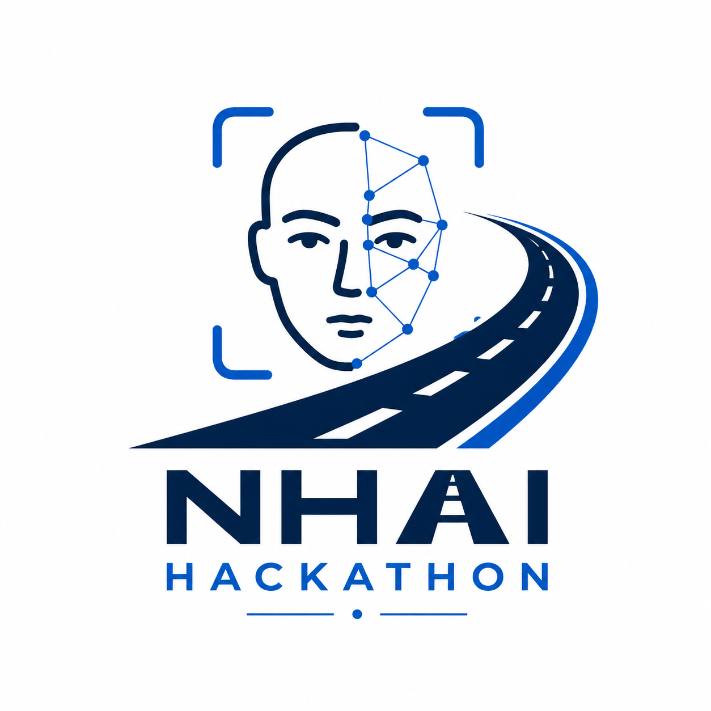

<div align="center">
  <!-- If Logo.png is in the repo, use it here -->
  
  
  <h1>🛡️ NHAIFaceID SDK</h1>
  
  <p><strong>Ultra-Fast, Offline Facial Recognition & Passive Liveness Detection SDK for NHAI Datalake 3.0</strong></p>
  
  <p>
    
    
    
    
  </p>
</div>

<hr/>

<h2 align="center"><em><strong>📖 Overview</strong></em></h2>

**NHAIFaceID** is a lightweight, fully offline facial recognition and anti-spoofing SDK built specifically for field operations at the **National Highways Authority of India (NHAI)**. 

Designed for **Datalake 3.0**, this SDK allows NHAI field personnel and contractors to authenticate themselves on remote construction sites—even in **zero-network zones**. The system guarantees extremely fast processing while maintaining an incredibly small AI model footprint to ensure compatibility with standard-issue mobile devices.

---

<h2 align="center"><em><strong>🚀 Key Achievements</strong></em></h2>

- 📉 **Tiny Footprint (<3MB):** Reduced the AI model footprint drastically. BlazeFace (1.0MB) + MobileFaceNet (1.9MB) = ~2.9MB total model size.
- ⚡ **Lightning Fast (<300ms):** Highly optimized Native Kotlin pipeline performs Face Detection, Passive Liveness, Embedding extraction, and Math matching in under 300ms.
- 📴 **100% Offline Capability:** Powered by a local SQLite database for matching 192-Dimensional embeddings instantly without needing an internet connection.
- 🛡️ **Military-Grade Liveness:** Employs ONNX Anti-Spoofing, LBP Texture analysis, and Specular HSV reflection detection to actively block 2D photos, masks, and screen replays.

---

<h2 align="center"><em><strong>🧠 Core Architecture</strong></em></h2>

Unlike standard React Native wrappers, NHAIFaceID shifts heavy AI compute to **Native Android/Kotlin**:

1. **Native MobileFaceNet Inference:** A custom Kotlin module (`FaceRecognitionModule.kt`) runs the TensorFlow Lite C++ API. It returns an exact 192-dimensional, L2-normalized embedding.
2. **Passive Liveness Defense:** Uses a parallel pipeline to verify liveness (texture, specular reflection, and depth variance) before ANY data is saved or matched.
3. **Pure Cosine Similarity:** Embeddings are mathematically compared using pure Cosine Similarity (Dot Product), negating the need for fragile geometry-based hashes.
4. **AWS Offline Sync Queue:** Verification logs are cached locally and automatically pushed to the NHAI AWS Datalake immediately when network connectivity is restored.

---

<h2 align="center"><em><strong>⚙️ The Pipeline Flow</strong></em></h2>

### 1️⃣ Enrollment Process (Zero Spoofing Allowed)
- **Capture & Liveness Audit:** A fast ONNX check ensures a live human is presenting the face.
- **Native Embedding Extraction:** Multiple 192-D arrays are extracted and averaged in JS to create a perfect master embedding.
- **Deduplication:** A strict check against SQLite (`cosineSimilarity >= 0.60`) prevents duplicate employee registrations.
- **Storage:** Securely saves the `employee_id`, `name`, and `192-D embedding` into the offline database.

### 2️⃣ Verification Process (Sub-300ms Check)
- **Early-Exit Liveness:** Instantly rejects paper grains or flat 2D frames.
- **Live 192-D Extraction:** Kotlin dynamically generates a new embedding.
- **Math Matching:** Quickly iterates through the SQLite database using dot product math. (`MATCH` requires `>= 0.55` similarity).
- **Audit Queue:** Logs the result locally and triggers the background AWS sync process.

---

<h2 align="center"><em><strong>💻 Integration (Datalake 3.0)</strong></em></h2>

Integrating NHAIFaceID into an existing React Native app is incredibly straightforward.

```javascript
import NHAIFaceSDK from './src/NHAIFaceSDK';

// 1. Initialize DB and Pre-warm Native Models on Boot
await NHAIFaceSDK.initialize();

// 2. Enroll a New Worker
try {
  await NHAIFaceSDK.enrollEmbedding('NHAI-982', 'Rahul Sharma', nativeEmbedding, landmarks);
  console.log('Worker enrolled successfully!');
} catch (error) {
  console.error('Enrollment Failed:', error.message);
}

// 3. Mark Attendance (Instant Offline Verification)
const result = await NHAIFaceSDK.verifyEmbedding(liveEmbedding, landmarks, 'Device-A1');

if (result.status === 'MATCH') {
  console.log(`Verified: ${result.employee.name} in ${result.processingTimeMs}ms`);
} else if (result.status === 'REJECTED_SPOOF') {
  console.warn(`Spoof Blocked! Liveness Score: ${result.livenessScore}`);
}
```

---

<h2 align="center"><em><strong>📂 File Structure</strong></em></h2>

```text
NHAIFaceID/
│
├── android/app/src/.../FaceRecognitionModule.kt  ← 🔥 Native Kotlin TFLite execution
├── src/
│   ├── NHAIFaceSDK.js                            ← 🧠 Core SDK Wrapper
│   ├── services/
│   │   ├── awsSync.js                            ← ☁️ Background Datalake upload
│   │   ├── faceDetection.js                      ← 👁️ BlazeFace initialization
│   │   ├── faceRecognition.js                    ← 🧮 Bridge to Native Kotlin Module
│   │   ├── livenessDetection.js                  ← 🛡️ Passive anti-spoof logic
│   │   ├── localStorage.js                       ← 💾 SQLite DB operations
│   │   └── antiSpoofCheck.js                     ← 🤖 ONNX liveness model runner
│   ├── utils/
│   │   └── vectorMath.js                         ← 📐 Cosine Similarity math functions
│   └── ...
```

---

<div align="center">
  <i>Built for <b>NHAI Hackathon 7.0</b> to modernize remote field authentication.</i>
</div>
